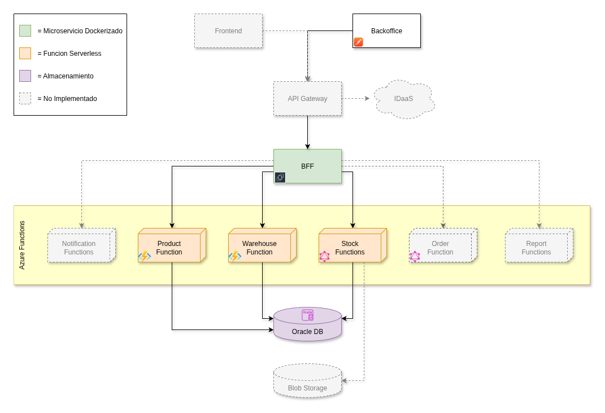

# 📦 Sistema de Inventario de Productos

## 📌 Descripción

Este proyecto corresponde al encargo para la **Evaluación Sumativa** de la asignatura **Desarrollo Cloud Native II (DSY2207)**:

**“Implementando un sistema con arquitectura Serverless”**.

Se diseñó e implementó un **sistema de inventario de productos** utilizando un **enfoque 100% backend**, compuesto por:

* Microservicio **BFF** (Java, Docker) encargado de orquestar las llamadas.
* Funciones **Serverless en Azure Functions (Java)**:
  * `ProductsFn` → CRUD de productos.
  * `WarehousesFn` → CRUD de bodegas.
  * `StockFn` → Consultas de stock (GraphQL).
* **Oracle Autonomous DB** (conexión vía Wallet).
* **GraphQL Provider** integrado para consultas y mutaciones básicas.

El sistema está preparado para ser desplegado tanto en **Docker (BFF en EC2)** como en **Azure Functions**.

---

## 🏗️ Arquitectura

### Diagrama actualizado de la solución



**Componentes actuales:**

* **BFF (Java, Docker):** expone endpoints REST y GraphQL, orquesta las funciones.
* **ProductsFn:** operaciones CRUD sobre productos.
* **WarehousesFn:** operaciones CRUD sobre bodegas.
* **StockFn (GraphQL):** consultas de stock y mutación de recepción de productos.
* **Oracle DB:** persistencia de productos, bodegas, movimientos y stock.

---

## ⚙️ Funcionalidades implementadas

### REST (Azure Functions)

* **Productos**

  * Alta, baja, modificación y consulta de productos.
* **Bodegas**

  * Alta, baja, modificación y consulta de bodegas.

### GraphQL (Azure Functions)

* **Queries**

  * `stock(productId, warehouseId, limit, offset)` → consulta de stock filtrado.
* **Mutations**

  * `receiveStock(productId, warehouseId, qty, reference)` → registrar ingreso de stock.

### BFF

* Exposición unificada vía REST y GraphQL.
* Uso de **DataLoader** para resolver dependencias (productos y bodegas) de manera eficiente.

---

## 📂 Estructura del repositorio

```
.
├── bff/                # Microservicio orquestador (Java, Docker)
├── functions/          # Azure Functions (ProductsFn, WarehousesFn, StockFn)
├── scripts/            # Scripts de creación de tablas y datos iniciales
├── docs/               # Diagramas y documentación
└── README.md
```

---

## 🚀 Despliegue

### BFF en EC2

1. Construcción del contenedor:

   ```bash
   docker build -t inventario-bff .
   docker run -p 8080:8080 inventario-bff
   ```
2. Acceso en: `http://<EC2-IP>:8080`

### Funciones en Azure

* Despliegue automatizado vía **GitHub Actions** con `azure/functions-action@v1`.
* Variables sensibles manejadas en **Azure Configuration**.

