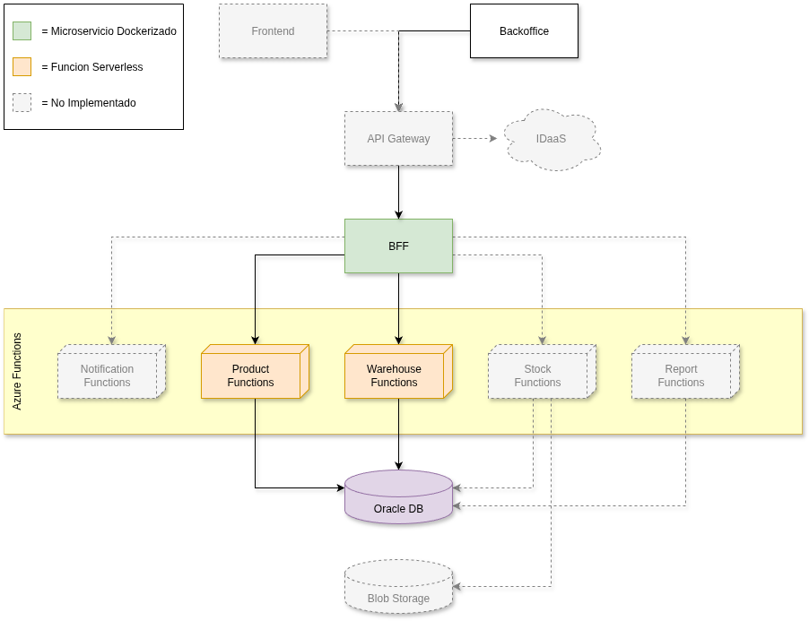

# 📦 Sistema de Inventario de Productos

---

## 📌 Descripción

Este proyecto corresponde al encargo para la **Evaluación Sumativa** de la asignatura **Desarrollo Cloud Native II**:  

**“Implementando un sistema con arquitectura Serverless”**.

Se diseñó e implementó un **sistema de inventario de productos** utilizando un **enfoque 100% backend**, compuesto por:
- Microservicio **BFF** (Spring Boot en Java, Docker).
- Funciones **Serverless en Azure Functions (Java)**:
  - `ProductsFn` → CRUD de productos.
  - `WarehousesFn` → CRUD de bodegas.
- **Oracle Autonomous DB** (conexión vía Wallet).

---

## 🏗️ Arquitectura

### Diagrama de la versión orientada a la evaluación

**Componentes actuales:**
- **BFF (Spring Boot):** expone endpoints REST, orquesta llamadas a funciones.  
- **ProductsFn:** operaciones CRUD de productos.
- **WarehousesFn:** operaciones CRUD de bodegas.  
- **Oracle DB:** Base de Datos Oracle Cloud.  

