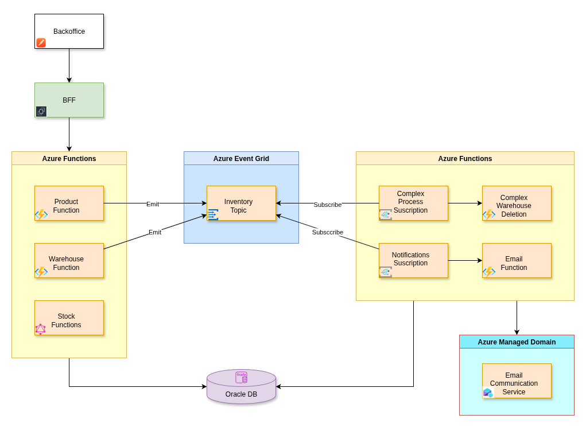

# 📦 Sistema de Inventario de Productos


## 📌 Descripción

Este proyecto corresponde al encargo para la **Evaluación Sumativa** de la asignatura **Desarrollo Cloud Native II (DSY2207)**:

**“Implementando un sistema con arquitectura Serverless y orientada a eventos”**.

Se diseñó e implementó un **sistema de inventario de productos y bodegas** utilizando un enfoque **100% backend serverless**, con:

* **BFF (Java, Docker)** que expone endpoints REST/GraphQL y orquesta peticiones.
* **Funciones Azure (Java)** organizadas por dominio:

  * `ProductsFn` → CRUD de productos.
  * `WarehousesFn` → CRUD de bodegas.
  * `StockFn` → consultas de stock vía GraphQL.
  * `NotificationsFn` → suscripción a eventos de C/U/D para enviar emails.
  * `ComplexFn` → suscripción para manejar operaciones complejas (ej: borrado de bodega o producto).
* **Oracle Autonomous DB** para persistencia de productos, bodegas, stock, contactos y auditoría.
* **Event Grid** como bus de eventos para integración y desac acoplamiento.
* **Azure Communication Services – Email** como canal de notificaciones.

---

## 🏗️ Arquitectura

### Diagrama actualizado de la solución



**Componentes clave:**

* **BFF (Java, Docker):** capa de entrada con endpoints REST y GraphQL.
* **Functions (Java):**
  * `ProductsFn`, `WarehousesFn`, `StockFn` → CRUD y consultas.
  * `NotificationSubscription` → procesa eventos C/U/D de productos y bodegas para enviar emails.
  * `ComplexSubscription` → maneja operaciones complejas que requieren coordinación entre varios servicios (ej: borrado de bodega → elimina stock, contactos y desactiva productos).
* **Event Grid:** desacopla productores (Functions) y consumidores (otras Functions, notificaciones).
* **Oracle DB:** esquema con entidades `PRODUCTS`, `WAREHOUSES`, `CONTACTS`, `STOCKS`, `STOCK_MOVEMENTS`, etc.
* **Azure Communication Services:** envío de correos basados en plantillas HTML con placeholders.

---

## ⚙️ Funcionalidades implementadas

### REST (Azure Functions)

* **Productos**

  * Crear, modificar, eliminar y consultar productos.
* **Bodegas**

  * Crear, modificar, eliminar (EPIC orquestado) y consultar bodegas.
* **Contactos**

  * Asociar contactos a bodegas, designar administrador, desvincular.

### GraphQL (Azure Functions)

* **Queries**

  * `stock(productId, warehouseId, limit, offset)` → consulta stock filtrado.
* **Mutations**

  * `receiveStock(productId, warehouseId, qty, reference)` → registrar ingreso.
  * `transferStock(productId, sourceWarehouse, targetWarehouse, qty)` → transferencia entre bodegas.

### Notificaciones (Event Grid + ACS)

* Suscripción **NotificationSubscription**:

  * Procesa eventos `product.created|updated|deleted`, `warehouse.created|updated|deleting`.
  * Mapea los datos a un `NotificationDto` y genera correos personalizados.
* Plantillas HTML en `resources/templates/` con placeholders dinámicos (`--product_name--`, `--warehouse_name--`, etc.).

### Procesos complejos (EPICs)

* Suscripción **ProcessSubscription**:

  * Maneja eventos `warehouse.deletion.requested` y `product.deletion.requested`.
  * Coordina borrado lógico de dependencias: stocks, contactos, productos huérfanos.
  * Publica evento `*.deletion.completed` con resumen para notificación.

---

## 📂 Estructura del repositorio

```
.
├── bff/                # Microservicio orquestador (Java, Docker)
├── functions/          # Azure Functions (ProductsFn, WarehousesFn, StockFn, NotificationsFn, ProcessFn)
├── resources/
│   └── templates/      # Plantillas HTML para notificaciones
├── scripts/            # Scripts SQL de creación de tablas y datos iniciales
├── docs/               # Diagramas y documentación
└── README.md
```

